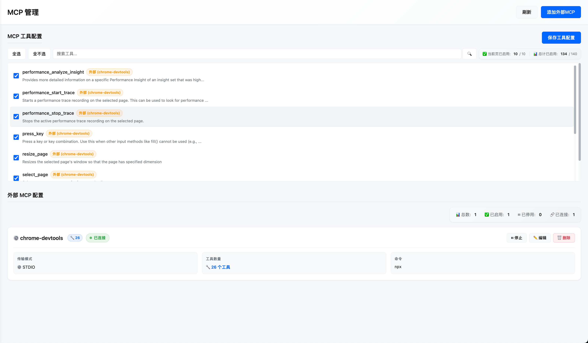
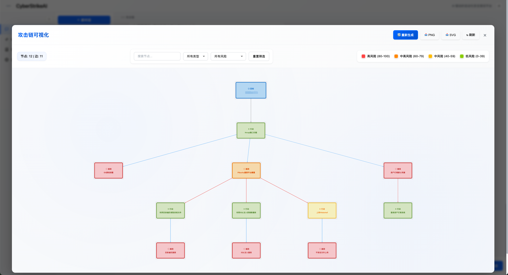

<div align="center">
  
</div>

# CyberStrikeAI


[中文](README_CN.md) | [English](README.md)

CyberStrikeAI is an **AI-native security testing platform** built in Go. It integrates 100+ security tools, an intelligent orchestration engine, and comprehensive lifecycle management capabilities. Through native MCP protocol and AI agents, it enables end-to-end automation from conversational commands to vulnerability discovery, attack-chain analysis, knowledge retrieval, and result visualization—delivering an auditable, traceable, and collaborative testing environment for security teams.


## Interface & Integration Preview

### Web Console


### MCP Integration
- **MCP stdio mode**  
  
- **MCP management**  
  

### Attack Chain Visualization


### Vulnerability Management


### Task Management


## Highlights

- 🤖 AI decision engine with OpenAI-compatible models (GPT, Claude, DeepSeek, etc.)
- 🔌 Native MCP implementation with HTTP/stdio transports and external MCP federation
- 🧰 100+ prebuilt tool recipes + YAML-based extension system
- 📄 Large-result pagination, compression, and searchable archives
- 🔗 Attack-chain graph, risk scoring, and step-by-step replay
- 🔒 Password-protected web UI, audit logs, and SQLite persistence
- 📚 Knowledge base with vector search and hybrid retrieval for security expertise
- 📁 Conversation grouping with pinning, rename, and batch management
- 🛡️ Vulnerability management with CRUD operations, severity tracking, status workflow, and statistics
- 📋 Batch task management: create task queues, add multiple tasks, and execute them sequentially

## Tool Overview

CyberStrikeAI ships with 100+ curated tools covering the whole kill chain:

- **Network Scanners** – nmap, masscan, rustscan, arp-scan, nbtscan
- **Web & App Scanners** – sqlmap, nikto, dirb, gobuster, feroxbuster, ffuf, httpx
- **Vulnerability Scanners** – nuclei, wpscan, wafw00f, dalfox, xsser
- **Subdomain Enumeration** – subfinder, amass, findomain, dnsenum, fierce
- **Network Space Search Engines** – fofa_search, zoomeye_search
- **API Security** – graphql-scanner, arjun, api-fuzzer, api-schema-analyzer
- **Container Security** – trivy, clair, docker-bench-security, kube-bench, kube-hunter
- **Cloud Security** – prowler, scout-suite, cloudmapper, pacu, terrascan, checkov
- **Binary Analysis** – gdb, radare2, ghidra, objdump, strings, binwalk
- **Exploitation** – metasploit, msfvenom, pwntools, ropper, ropgadget
- **Password Cracking** – hashcat, john, hashpump
- **Forensics** – volatility, volatility3, foremost, steghide, exiftool
- **Post-Exploitation** – linpeas, winpeas, mimikatz, bloodhound, impacket, responder
- **CTF Utilities** – stegsolve, zsteg, hash-identifier, fcrackzip, pdfcrack, cyberchef
- **System Helpers** – exec, create-file, delete-file, list-files, modify-file

## Basic Usage

### Quick Start
1. **Clone & install**
   ```bash
   git clone https://github.com/Ed1s0nZ/CyberStrikeAI.git
   cd CyberStrikeAI-main
   go mod download
   ```
2. **Set up the Python tooling stack (required for the YAML tools directory)**  
   A large portion of `tools/*.yaml` recipes wrap Python utilities (`api-fuzzer`, `http-framework-test`, `install-python-package`, etc.). Create the project-local virtual environment once and install the shared dependencies:
   ```bash
   python3 -m venv venv
   source venv/bin/activate
   pip install -r requirements.txt
   ```
   The helper tools automatically detect this `venv` (or any already active `$VIRTUAL_ENV`), so the default `env_name` works out of the box unless you intentionally supply another target.
3. **Configure OpenAI-compatible access**  
   Either open the in-app `Settings` panel after launch or edit `config.yaml`:
   ```yaml
   openai:
     api_key: "sk-your-key"
     base_url: "https://api.openai.com/v1"
     model: "gpt-4o"
   auth:
     password: ""                  # empty = auto-generate & log once
     session_duration_hours: 12
   security:
     tools_dir: "tools"
   ```
4. **Install the tooling you need (optional)**
   ```bash
   # macOS
   brew install nmap sqlmap nuclei httpx gobuster feroxbuster subfinder amass
   # Ubuntu/Debian
   sudo apt-get install nmap sqlmap nuclei httpx gobuster feroxbuster
   ```
   AI automatically falls back to alternatives when a tool is missing.
5. **Launch**
   ```bash
   chmod +x run.sh && ./run.sh
   # or
   go run cmd/server/main.go
   # or
   go build -o cyberstrike-ai cmd/server/main.go
   ```
6. **Open the console** at http://localhost:8080, log in with the generated password, and start chatting.

### Core Workflows
- **Conversation testing** – Natural-language prompts trigger toolchains with streaming SSE output.
- **Tool monitor** – Inspect running jobs, execution logs, and large-result attachments.
- **History & audit** – Every conversation and tool invocation is stored in SQLite with replay.
- **Conversation groups** – Organize conversations into groups, pin important groups, rename or delete groups via context menu.
- **Vulnerability management** – Create, update, and track vulnerabilities discovered during testing. Filter by severity (critical/high/medium/low/info), status (open/confirmed/fixed/false_positive), and conversation. View statistics and export findings.
- **Batch task management** – Create task queues with multiple tasks, add or edit tasks before execution, and run them sequentially. Each task executes as a separate conversation, with status tracking (pending/running/completed/failed/cancelled) and full execution history.
- **Settings** – Tweak provider keys, MCP enablement, tool toggles, and agent iteration limits.

### Built-in Safeguards
- Required-field validation prevents accidental blank API credentials.
- Auto-generated strong passwords when `auth.password` is empty.
- Unified auth middleware for every web/API call (Bearer token flow).
- Timeout and sandbox guards per tool, plus structured logging for triage.

## Advanced Usage

### Tool Orchestration & Extensions
- **YAML recipes** in `tools/*.yaml` describe commands, arguments, prompts, and metadata.
- **Directory hot-reload** – pointing `security.tools_dir` to a folder is usually enough; inline definitions in `config.yaml` remain supported for quick experiments.
- **Large-result pagination** – outputs beyond 200 KB are stored as artifacts retrievable through the `query_execution_result` tool with paging, filters, and regex search.
- **Result compression** – multi-megabyte logs can be summarized or losslessly compressed before persisting to keep SQLite lean.

**Creating a custom tool (typical flow)**
1. Copy an existing YAML file from `tools/` (for example `tools/sample.yaml`).
2. Update `name`, `command`, `args`, and `short_description`.
3. Describe positional or flag parameters in `parameters[]` so the agent knows how to build CLI arguments.
4. Provide a longer `description`/`notes` block if the agent needs extra context or post-processing tips.
5. Restart the server or reload configuration; the new tool becomes available immediately and can be enabled/disabled from the Settings panel.

### Attack-Chain Intelligence
- AI parses each conversation to assemble targets, tools, vulnerabilities, and relationships.
- The web UI renders the chain as an interactive graph with severity scoring and step replay.
- Export the chain or raw findings to external reporting pipelines.

### MCP Everywhere
- **Web mode** – ships with HTTP MCP server automatically consumed by the UI.
- **MCP stdio mode** – `go run cmd/mcp-stdio/main.go` exposes the agent to Cursor/CLI.
- **External MCP federation** – register third-party MCP servers (HTTP or stdio) from the UI, toggle them per engagement, and monitor their health and call volume in real time.

#### MCP stdio quick start
1. **Build the binary** (run from the project root):
   ```bash
   go build -o cyberstrike-ai-mcp cmd/mcp-stdio/main.go
   ```
2. **Wire it up in Cursor**  
   Open `Settings → Tools & MCP → Add Custom MCP`, pick **Command**, then point to the compiled binary and your config:
   ```json
   {
     "mcpServers": {
       "cyberstrike-ai": {
         "command": "/absolute/path/to/cyberstrike-ai-mcp",
         "args": [
           "--config",
           "/absolute/path/to/config.yaml"
         ]
       }
     }
   }
   ```
   Replace the paths with your local locations; Cursor will launch the stdio server automatically.

#### MCP HTTP quick start
1. Ensure `config.yaml` has `mcp.enabled: true` and adjust `mcp.host` / `mcp.port` if you need a non-default binding (localhost:8081 works well for local Cursor usage).
2. Start the main service (`./run.sh` or `go run cmd/server/main.go`); the MCP endpoint lives at `http://<host>:<port>/mcp`.
3. In Cursor, choose **Add Custom MCP → HTTP** and set `Base URL` to `http://127.0.0.1:8081/mcp`.
4. Prefer committing the setup via `.cursor/mcp.json` so teammates can reuse it:
   ```json
   {
     "mcpServers": {
       "cyberstrike-ai-http": {
         "transport": "http",
         "url": "http://127.0.0.1:8081/mcp"
       }
     }
   }
   ```

### Knowledge Base
- **Vector search** – AI agent can automatically search the knowledge base for relevant security knowledge during conversations using the `search_knowledge_base` tool.
- **Hybrid retrieval** – combines vector similarity search with keyword matching for better accuracy.
- **Auto-indexing** – scans the `knowledge_base/` directory for Markdown files and automatically indexes them with embeddings.
- **Web management** – create, update, delete knowledge items through the web UI, with category-based organization.
- **Retrieval logs** – tracks all knowledge retrieval operations for audit and debugging.

**Quick Start (Using Pre-built Knowledge Base):**
1. **Download the knowledge database** – Download the pre-built knowledge database file from [GitHub Releases](https://github.com/Ed1s0nZ/CyberStrikeAI/releases).
2. **Extract and place** – Extract the downloaded knowledge database file (`knowledge.db`) and place it in the project's `data/` directory.
3. **Restart the service** – Restart the CyberStrikeAI service, and the knowledge base will be ready to use immediately without rebuilding the index.

**Setting up the knowledge base:**
1. **Enable in config** – set `knowledge.enabled: true` in `config.yaml`:
   ```yaml
   knowledge:
     enabled: true
     base_path: knowledge_base
     embedding:
       provider: openai
       model: text-embedding-v4
       base_url: "https://api.openai.com/v1"  # or your embedding API
       api_key: "sk-xxx"
     retrieval:
       top_k: 5
       similarity_threshold: 0.7
       hybrid_weight: 0.7
   ```
2. **Add knowledge files** – place Markdown files in `knowledge_base/` directory, organized by category (e.g., `knowledge_base/SQL Injection/README.md`).
3. **Scan and index** – use the web UI to scan the knowledge base directory, which will automatically import files and build vector embeddings.
4. **Use in conversations** – the AI agent will automatically use `search_knowledge_base` when it needs security knowledge. You can also explicitly ask: "Search the knowledge base for SQL injection techniques".

**Knowledge base structure:**
- Files are organized by category (directory name becomes the category).
- Each Markdown file becomes a knowledge item with automatic chunking for vector search.
- The system supports incremental updates – modified files are re-indexed automatically.


### Automation Hooks
- **REST APIs** – everything the UI uses (auth, conversations, tool runs, monitor, vulnerabilities) is available over JSON.
- **Vulnerability APIs** – manage vulnerabilities via `/api/vulnerabilities` endpoints: `GET /api/vulnerabilities` (list with filters), `POST /api/vulnerabilities` (create), `GET /api/vulnerabilities/:id` (get), `PUT /api/vulnerabilities/:id` (update), `DELETE /api/vulnerabilities/:id` (delete), `GET /api/vulnerabilities/stats` (statistics).
- **Batch Task APIs** – manage batch task queues via `/api/batch-tasks` endpoints: `POST /api/batch-tasks` (create queue), `GET /api/batch-tasks` (list queues), `GET /api/batch-tasks/:queueId` (get queue), `POST /api/batch-tasks/:queueId/start` (start execution), `POST /api/batch-tasks/:queueId/cancel` (cancel), `DELETE /api/batch-tasks/:queueId` (delete), `POST /api/batch-tasks/:queueId/tasks` (add task), `PUT /api/batch-tasks/:queueId/tasks/:taskId` (update task), `DELETE /api/batch-tasks/:queueId/tasks/:taskId` (delete task). Tasks execute sequentially, each creating a separate conversation with full status tracking.
- **Task control** – pause/resume/stop long scans, re-run steps with new params, or stream transcripts.
- **Audit & security** – rotate passwords via `/api/auth/change-password`, enforce short-lived sessions, and restrict MCP ports at the network layer when exposing the service.

## Configuration Reference

```yaml
auth:
  password: "change-me"
  session_duration_hours: 12
server:
  host: "0.0.0.0"
  port: 8080
log:
  level: "info"
  output: "stdout"
mcp:
  enabled: true
  host: "0.0.0.0"
  port: 8081
openai:
  api_key: "sk-xxx"
  base_url: "https://api.deepseek.com/v1"
  model: "deepseek-chat"
database:
  path: "data/conversations.db"
  knowledge_db_path: "data/knowledge.db"  # Optional: separate DB for knowledge base
security:
  tools_dir: "tools"
knowledge:
  enabled: false  # Enable knowledge base feature
  base_path: "knowledge_base"  # Path to knowledge base directory
  embedding:
    provider: "openai"  # Embedding provider (currently only "openai")
    model: "text-embedding-v4"  # Embedding model name
    base_url: ""  # Leave empty to use OpenAI base_url
    api_key: ""  # Leave empty to use OpenAI api_key
  retrieval:
    top_k: 5  # Number of top results to return
    similarity_threshold: 0.7  # Minimum similarity score (0-1)
    hybrid_weight: 0.7  # Weight for vector search (1.0 = pure vector, 0.0 = pure keyword)
```

### Tool Definition Example (`tools/nmap.yaml`)

```yaml
name: "nmap"
command: "nmap"
args: ["-sT", "-sV", "-sC"]
enabled: true
short_description: "Network mapping & service fingerprinting"
parameters:
  - name: "target"
    type: "string"
    description: "IP or domain"
    required: true
    position: 0
  - name: "ports"
    type: "string"
    flag: "-p"
    description: "Range, e.g. 1-1000"
```

## Project Layout

```
CyberStrikeAI/
├── cmd/                 # Server, MCP stdio entrypoints, tooling
├── internal/            # Agent, MCP core, handlers, security executor
├── web/                 # Static SPA + templates
├── tools/               # YAML tool recipes (100+ examples provided)
├── img/                 # Docs screenshots & diagrams
├── config.yaml          # Runtime configuration
├── run.sh               # Convenience launcher
└── README*.md
```

## Basic Usage Examples

```
Scan open ports on 192.168.1.1
Perform a comprehensive port scan on 192.168.1.1 focusing on 80,443,22
Check if https://example.com/page?id=1 is vulnerable to SQL injection
Scan https://example.com for hidden directories and outdated software
Enumerate subdomains for example.com, then run nuclei against the results
```

## Advanced Playbooks

```
Load the recon-engagement template, run amass/subfinder, then brute-force dirs on every live host.
Use external Burp-based MCP server for authenticated traffic replay, then pass findings back for graphing.
Compress the 5 MB nuclei report, summarize critical CVEs, and attach the artifact to the conversation.
Build an attack chain for the latest engagement and export the node list with severity >= high.
```

## Changelog (Recent)

- 2026-01-01 – Added batch task management feature: create task queues with multiple tasks, add/edit/delete tasks before execution, and execute them sequentially. Each task runs as a separate conversation with status tracking (pending/running/completed/failed/cancelled). All queues and tasks are persisted in the database.
- 2025-12-25 – Added vulnerability management feature: full CRUD operations for tracking vulnerabilities discovered during testing. Supports severity levels (critical/high/medium/low/info), status workflow (open/confirmed/fixed/false_positive), filtering by conversation/severity/status, and comprehensive statistics dashboard.
- 2025-12-25 – Added conversation grouping feature: organize conversations into groups, pin groups to top, rename/delete groups via context menu. All group data is persisted in the database.
- 2025-12-24 – Refactored attack chain generation logic, achieving 2x faster generation speed. Redesigned attack chain frontend visualization for improved user experience.
- 2025-12-20 – Added knowledge base feature with vector search, hybrid retrieval, and automatic indexing. AI agent can now search security knowledge during conversations.
- 2025-12-19 – Added ZoomEye network space search engine tool (zoomeye_search) with support for IPv4/IPv6/web assets, facets statistics, and flexible query parameters.
- 2025-12-18 – Optimized web frontend with enhanced sidebar navigation and improved user experience.
- 2025-12-07 – Added FOFA network space search engine tool (fofa_search) with flexible query parameters and field configuration.
- 2025-12-07 – Fixed positional parameter handling bug: ensure correct parameter position when using default values.
- 2025-11-20 – Added automatic compression/summarization for oversized tool logs and MCP transcripts.
- 2025-11-17 – Introduced AI-built attack-chain visualization with interactive graph and risk scoring.
- 2025-11-15 – Delivered large-result pagination, advanced filtering, and external MCP federation.
- 2025-11-14 – Optimized tool lookups (O(1)), execution record cleanup, and DB pagination.
- 2025-11-13 – Added web authentication, settings UI, and MCP stdio mode integration.

## 404Starlink 


CyberStrikeAI has joined [404Starlink](https://github.com/knownsec/404StarLink)

## TCH Top-Ranked Intelligent Pentest Project  
<div align="left">
  <a href="https://zc.tencent.com/competition/competitionHackathon?code=cha004" target="_blank">
    
  </a>
</div>


---

Need help or want to contribute? Open an issue or PR—community tooling additions are welcome!
