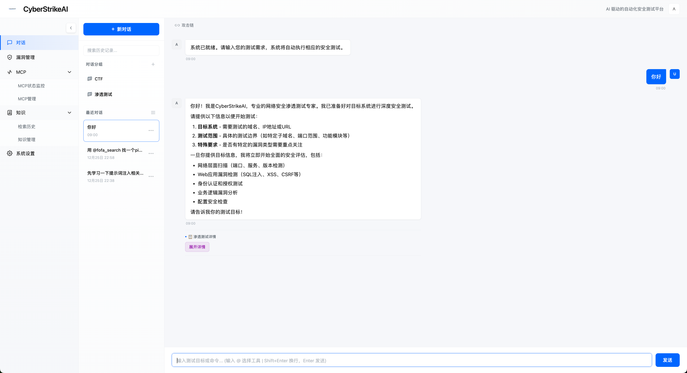
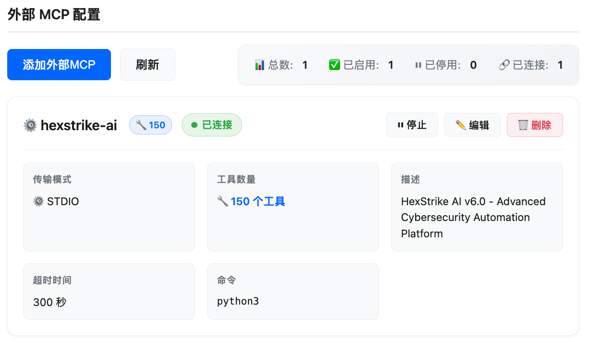

<div align="center">
  
</div>

# CyberStrikeAI

[English](README.md) | [中文](README_CN.md)

🚀 **AI自主渗透测试平台** - 基于Golang构建，内置上百个安全工具，支持灵活扩展自定义工具，通过MCP协议实现AI智能决策与自动化执行，让安全测试像对话一样简单。
- web模式   
  
  
- mcp-stdio / mcp-http 模式   
  
  
- 外部MCP服务器集成（支持 stdio 和 HTTP 传输模式）   
  

- 攻击链可视化   
  
  
## 更新日志
- 2025.11.20 对超大日志、MCP 对话和附件自动执行无损压缩或“摘要+原文”分层压缩，显著降低数据库与共享文件体积，同时保留定位漏洞所需的上下文 
- 2025.11.17 新增攻击链可视化功能：基于AI分析自动从对话中构建攻击链，可视化展示工具执行流程、漏洞发现路径和节点间关联关系，支持交互式图谱探索和风险评分
- 2025.11.15 新增大结果分段读取功能：当工具执行结果超过阈值（默认200KB）时，自动保存到文件并返回执行ID，支持通过 query_execution_result 工具进行分页查询、关键词搜索、条件过滤和正则表达式匹配，有效解决单次返回过长的问题，提升大文件处理能力
- 2025.11.15 新增外部 MCP 接入功能：支持接入外部 MCP 服务器扩展工具能力，支持 stdio 和 HTTP 两种传输模式，支持工具级别的启用/禁用控制，提供完整的配置指南和管理接口
- 2025.11.14 性能优化：工具查找从 O(n) 优化为 O(1)（使用索引映射），添加执行记录自动清理机制防止内存泄漏，数据库查询支持分页加载
- 2025.11.13 Web 端新增统一鉴权，支持自动生成强密码与前端修改密码
- 2025.11.13 在前端新增`设置`功能
- 2025.11.13 新增 MCP Stdio 模式支持，现可在代码编辑器、CLI 及自动化脚本等多种场景下，无缝集成并使用全套安全工具
- 2025.11.12 增加了任务停止功能，优化前端


## ✨ 功能特性

### 核心功能
- 🤖 **AI智能代理** - 集成OpenAI兼容API（支持GPT、Claude、DeepSeek等），AI自主决策和执行安全测试
- 🧠 **智能决策引擎** - AI分析目标并自动选择最佳测试策略和工具组合
- ⚡ **自主执行** - AI代理自动调用安全工具，无需人工干预
- 🔄 **自适应调整** - 根据工具执行结果和发现的漏洞，AI自动调整测试策略
- 📝 **智能总结** - 达到最大迭代次数时，AI自动总结测试结果并提供下一步执行计划
- 💬 **对话式交互** - 自然语言对话界面，支持流式输出（SSE），实时查看执行过程
- 📊 **对话历史管理** - 完整的对话历史记录，支持查看、删除和管理
- ⚙️ **可视化配置管理** - Web界面配置系统设置，支持实时加载和保存配置，必填项验证
- 📄 **大结果分段读取** - 当工具执行结果超过阈值时自动保存，支持分页查询、关键词搜索、条件过滤和正则表达式匹配，有效解决单次返回过长问题，提供多种工具（head、tail、grep、sed等）的分段读取示例
- 🔗 **攻击链可视化** - 基于AI分析自动从对话中构建攻击链，可视化展示工具执行流程、漏洞发现路径以及目标、工具、漏洞、发现之间的关联关系，支持交互式图谱探索和风险评分

### 工具集成
- 🔌 **MCP协议支持** - 完整实现MCP协议，支持工具注册、调用、监控
- 📡 **双传输模式** - 支持HTTP和stdio两种传输方式，可在Web应用和IDE中无缝使用
- 🛠️ **灵活工具配置** - 支持从目录加载工具配置（YAML），易于扩展和维护
- 📈 **实时监控** - 监控所有工具的执行状态、结果、调用次数和统计信息
- 🔍 **漏洞自动分析** - 自动分析工具输出，提取和分类发现的漏洞

### 技术特性
- 🚀 **流式输出** - 支持Server-Sent Events (SSE)实时流式输出，提升用户体验
- 💾 **数据持久化** - SQLite数据库存储对话历史和过程详情
- 📝 **详细日志** - 结构化日志记录，便于调试和问题排查
- 🔒 **安全执行** - 工具执行隔离，错误处理和超时控制
- 🔐 **登录鉴权保护** - Web 端与 API 统一鉴权，中间件校验会话，并支持可配置会话有效期

## 📁 项目结构

```
CyberStrikeAI/
├── cmd/
│   ├── server/
│   │   └── main.go          # 程序入口，启动HTTP服务器
│   ├── mcp-stdio/
│   │   └── main.go          # MCP stdio模式入口（用于Cursor等IDE集成）
│   └── test-config/
│       └── main.go          # 配置测试工具
├── internal/
│   ├── agent/               # AI代理模块
│   │   └── agent.go         # Agent Loop实现，处理AI对话和工具调用
│   ├── app/                 # 应用初始化
│   │   └── app.go           # 应用主逻辑，路由设置
│   ├── config/              # 配置管理
│   │   └── config.go        # 配置加载和工具配置管理
│   ├── database/            # 数据库模块
│   │   ├── database.go      # 数据库连接和表结构
│   │   └── conversation.go  # 对话和消息数据访问
│   ├── handler/             # HTTP处理器
│   │   ├── agent.go         # Agent Loop API处理
│   │   ├── conversation.go  # 对话历史API处理
│   │   └── monitor.go       # 监控API处理
│   ├── logger/              # 日志系统
│   │   └── logger.go        # 结构化日志封装
│   ├── mcp/                 # MCP协议实现
│   │   ├── server.go        # MCP服务器核心逻辑
│   │   └── types.go         # MCP协议类型定义
│   └── security/            # 安全工具执行器
│       └── executor.go      # 工具执行和参数构建
├── tools/                   # 工具配置文件目录
│   ├── nmap.yaml            # nmap工具配置
│   ├── sqlmap.yaml          # sqlmap工具配置
│   ├── nikto.yaml           # nikto工具配置
│   ├── dirb.yaml            # dirb工具配置
│   ├── exec.yaml            # 系统命令执行工具配置
│   └── README.md            # 工具配置说明
├── web/                     # Web前端
│   ├── static/              # 静态资源
│   │   ├── css/
│   │   │   └── style.css    # 样式文件
│   │   └── js/
│   │       └── app.js       # 前端JavaScript逻辑
│   └── templates/           # HTML模板
│       └── index.html       # 主页面模板
├── data/                    # 数据目录（自动创建）
│   └── conversations.db     # SQLite数据库文件
├── config.yaml              # 主配置文件
├── go.mod                   # Go模块依赖
├── go.sum                   # Go依赖校验和
├── run.sh                   # 启动脚本
└── README.md                # 项目说明文档
```

## 快速开始

### 前置要求

- Go 1.21 或更高版本
- OpenAI API Key（或其他兼容OpenAI协议的API，如DeepSeek、Claude等）
- 安全工具（可选）：根据您的需求安装相应的安全工具，系统支持上百个工具

### 安装步骤

1. **克隆项目**
```bash
git clone https://github.com/Ed1s0nZ/CyberStrikeAI.git
cd CyberStrikeAI-main
```

2. **安装依赖**
```bash
go mod download
```

3. **配置**

#### 方式一：通过Web界面配置（推荐）

启动服务器后，在Web界面点击右上角的"设置"按钮，可以可视化配置：
- **OpenAI配置**：API Key、Base URL、模型（必填项，标记为 *）
- **MCP工具配置**：启用/禁用工具
- **Agent配置**：最大迭代次数等

配置会自动保存到 `config.yaml` 文件中。打开设置时会自动加载当前配置文件中的值。

#### 方式二：直接编辑配置文件

编辑 `config.yaml` 文件，设置您的API配置：

```yaml
# 身份认证配置
auth:
  password: ""                 # 可留空，首次启动自动生成强密码
  session_duration_hours: 12   # 登录有效期（小时）

# OpenAI兼容API配置（支持OpenAI、DeepSeek、Claude等）
openai:
  api_key: "sk-your-api-key-here"  # 替换为您的API Key
  base_url: "https://api.openai.com/v1"  # 或使用其他兼容API的地址
  model: "gpt-4"  # 或 "deepseek-chat", "gpt-3.5-turbo" 等

# 服务器配置
server:
  host: "0.0.0.0"
  port: 8080

# 数据库配置
database:
  path: "data/conversations.db"

# 安全工具配置
security:
  tools_dir: "tools"  # 工具配置文件目录
```

**支持的API服务商：**
- OpenAI: `https://api.openai.com/v1`
- DeepSeek: `https://api.deepseek.com/v1`
- 其他兼容OpenAI协议的API服务

**注意**：API Key、Base URL 和模型是必填项，必须配置才能正常运行系统。在Web界面配置时，这些字段会进行验证，未填写时会显示错误提示。

4. **安装安全工具（可选）**

根据您的需求安装相应的安全工具。系统支持上百个工具，您可以根据实际需要选择性安装：

```bash
# macOS (使用Homebrew)
brew install nmap sqlmap nuclei httpx gobuster feroxbuster subfinder amass

# Ubuntu/Debian
sudo apt-get install nmap sqlmap nuclei httpx gobuster feroxbuster

# 或使用Docker运行工具
# 或使用各工具的官方安装方法
```

Ubuntu安全工具批量安装脚本: `https://github.com/Ed1s0nZ/sec_tools/blob/main/install_tools_ubuntu.sh`

**注意**：不是所有工具都需要安装，AI会根据您的测试需求自动选择可用的工具。如果某个工具未安装，AI会尝试使用替代工具。

5. **启动服务器**

#### 方式一：使用启动脚本（推荐）
```bash
chmod +x run.sh
./run.sh
```

#### 方式二：直接运行
```bash
go run cmd/server/main.go
```

#### 方式三：编译后运行
```bash
go build -o cyberstrike-ai cmd/server/main.go
./cyberstrike-ai
```

#### 方式四：指定配置文件
```bash
go run cmd/server/main.go -config /path/to/config.yaml
```

6. **访问应用**
打开浏览器访问：http://localhost:8080

您将看到：
- **对话测试** - 与AI对话进行渗透测试
- **工具监控** - 查看工具执行状态和结果
- **对话历史** - 管理历史对话记录
- **系统设置** - 配置API密钥、工具启用状态等（点击右上角设置按钮）

**首次使用提示**：
- 在开始使用前，请先点击右上角的"设置"按钮配置您的API Key
- API Key、Base URL 和模型是必填项（标记为 *），必须填写才能正常使用
- 配置会自动保存到 `config.yaml` 文件中
- 打开设置时会自动加载当前配置文件中的最新配置
- 如果 `auth.password` 留空，程序首次启动会自动生成 24 位强密码，写回 `config.yaml` 并在终端输出中英文安全提示
- Web 首次访问会弹出登录框，请使用该密码登录；可在 **设置 → 安全设置** 中随时修改密码

## ⚙️ 配置说明

### Web界面配置管理

系统提供了可视化的配置管理界面，您可以通过以下方式访问：

1. **打开设置**：点击Web界面右上角的"设置"按钮
2. **加载配置**：打开设置时会自动从 `config.yaml` 加载当前配置
3. **修改配置**：
   - **OpenAI配置**：修改API Key、Base URL、模型（必填项标记为 *）
   - **MCP工具配置**：启用或禁用工具，支持搜索和批量操作
   - **Agent配置**：设置最大迭代次数等参数
4. **保存配置**：点击"应用配置"按钮，配置会保存到 `config.yaml` 并立即生效
5. **验证提示**：必填项未填写时会显示错误提示，并高亮显示错误字段

**配置验证规则**：
- API Key、Base URL、模型为必填项
- 保存时会自动验证，未填写必填项会阻止保存并提示错误

### 完整配置示例

```yaml
# 身份认证
auth:
  password: "change-me"          # Web 登录密码
  session_duration_hours: 12     # 会话有效期（小时）

# 服务器配置
server:
  host: "0.0.0.0"  # 监听地址
  port: 8080        # HTTP服务端口

# 日志配置
log:
  level: "info"     # 日志级别: debug, info, warn, error
  output: "stdout"  # 输出位置: stdout, stderr, 或文件路径

# MCP协议配置
mcp:
  enabled: true     # 是否启用MCP服务器
  host: "0.0.0.0"   # MCP服务器监听地址
  port: 8081        # MCP服务器端口

# AI模型配置（支持OpenAI兼容API）
openai:
  api_key: "sk-xxx"  # API密钥
  base_url: "https://api.deepseek.com/v1"  # API基础URL
  model: "deepseek-chat"  # 模型名称

# 数据库配置
database:
  path: "data/conversations.db"  # SQLite数据库路径

# 安全工具配置
security:
  # 推荐方式：从目录加载工具配置
  tools_dir: "tools"  # 工具配置文件目录（相对于配置文件所在目录）
  
  # 向后兼容：也可以在主配置文件中直接定义工具
  # tools:
  #   - name: "nmap"
  #     command: "nmap"
  #     args: ["-sT", "-sV", "-sC"]
  #     description: "网络扫描工具"
  #     enabled: true
```

### 工具配置方式

**方式一：使用工具目录（推荐）**

在 `tools/` 目录下为每个工具创建独立的YAML配置文件，例如 `tools/nmap.yaml`：

```yaml
name: "nmap"
command: "nmap"
args: ["-sT", "-sV", "-sC"]
enabled: true

short_description: "网络扫描工具，用于发现网络主机、开放端口和服务"

description: |
  网络映射和端口扫描工具，用于发现网络中的主机、服务和开放端口。

parameters:
  - name: "target"
    type: "string"
    description: "目标IP地址或域名"
    required: true
    position: 0
    format: "positional"
  
  - name: "ports"
    type: "string"
    description: "端口范围，例如: 1-1000"
    required: false
    flag: "-p"
    format: "flag"
```

**方式二：在主配置文件中定义**

直接在 `config.yaml` 的 `security.tools` 中定义工具配置。

**注意：** 如果同时配置了 `tools_dir` 和 `tools`，`tools_dir` 中的工具优先。

### 身份认证与安全

- **登录流程**：除 `/api/auth/login` 外，所有 `/api` 接口均需携带 `Authorization: Bearer <token>` 请求头。登录成功后返回的 token 会由前端自动缓存。
- **自动生成密码**：`auth.password` 为空时，启动会生成 24 位随机强密码，写回配置文件并在终端输出中英文提示，请务必妥善保管。
- **会话控制**：会话有效期由 `auth.session_duration_hours` 控制。过期或修改密码后需重新登录。
- **密码修改**：在 **设置 → 安全设置** 中即可修改密码，或直接调用 `/api/auth/change-password` 接口；修改会立即使所有旧会话失效。
- **MCP 端口**：独立 MCP 服务器（默认 `8081`）为了兼容 IDE 插件暂未启用鉴权，建议通过网络层限制访问范围。

## 🚀 使用示例

### 对话式渗透测试

在Web界面的"对话测试"标签页中，您可以使用自然语言与AI对话：

#### 1. 网络扫描
```
扫描 192.168.1.1 的开放端口
```
或更详细的指令：
```
对 192.168.1.1 进行全面的端口扫描，重点关注80、443、22、21端口
```

#### 2. SQL注入检测
```
检测 https://example.com/page?id=1 是否存在SQL注入漏洞
```

#### 3. Web漏洞扫描
```
扫描 https://example.com 的Web服务器漏洞，包括常见的安全问题
```

#### 4. 目录扫描
```
扫描 https://example.com 的隐藏目录和文件
```

#### 5. 综合安全测试
```
对 example.com 进行全面的安全评估，包括端口扫描、Web漏洞检测和目录枚举
```

#### 6. 多步骤测试
```
首先扫描 192.168.1.1 的开放端口，然后对发现的Web服务进行漏洞扫描
```

### 后渗透测试

在获得初始访问权限后，可以使用后渗透工具进行权限提升、横向移动和持久化：

#### 1. Linux 权限提升枚举
```
使用 linpeas 对目标 Linux 系统进行权限提升检查
```

#### 2. Windows 权限提升枚举
```
使用 winpeas 对目标 Windows 系统进行权限提升检查
```

#### 3. Active Directory 攻击路径分析
```
使用 bloodhound 分析 Active Directory 的攻击路径
```

#### 4. 凭证提取
```
使用 mimikatz 提取 Windows 系统的凭证信息
```

#### 5. 横向移动
```
使用 impacket 工具集进行网络协议攻击和横向移动
```

#### 6. 后门生成
```
使用 msfvenom 生成反向 shell 载荷
```

### CTF 竞赛支持

系统内置了丰富的 CTF 工具，支持各种 CTF 题型的解题：

#### 1. 隐写分析
```
使用 stegsolve 分析图片隐写
使用 zsteg 检测 LSB 隐写
```

#### 2. 密码破解
```
使用 hashcat 破解哈希值
使用 john 破解密码文件
使用 fcrackzip 破解 ZIP 文件密码
使用 pdfcrack 破解 PDF 文件密码
```

#### 3. 二进制分析
```
使用 gdb 调试二进制文件
使用 radare2 进行逆向分析
使用 strings 提取二进制文件中的字符串
```

#### 4. 哈希识别
```
使用 hash-identifier 识别哈希类型
```

#### 5. 数据转换和分析
```
使用 cyberchef 进行各种数据转换和分析
使用 xxd 查看文件十六进制内容
```

#### 6. 综合 CTF 解题
```
分析这个 CTF 题目：给定一个包含隐写和加密的文件，找出 flag
```

### 监控工具执行

在"工具监控"标签页中，您可以：

- 📊 **执行统计** - 查看所有工具的调用次数、成功/失败统计
- 📝 **执行记录** - 查看详细的工具执行历史，包括参数、结果、耗时
- 🔍 **漏洞列表** - 自动提取和分类发现的漏洞
- ⏱️ **实时状态** - 实时查看正在执行的工具状态

### 对话历史管理

- 📚 **查看历史** - 浏览所有历史对话记录
- 🔍 **搜索对话** - 根据标题搜索对话
- 🗑️ **删除对话** - 清理不需要的对话记录
- 📄 **查看详情** - 查看对话的完整消息和工具执行过程

## 效果

### 对话效果
  
  

### MCP调用
  

### 调用链
  
  

## 📡 API接口

### Agent Loop API

#### 标准请求（同步）

**POST** `/api/agent-loop`

请求体：
```json
{
  "message": "扫描 192.168.1.1",
  "conversationId": "optional-conversation-id"  // 可选，用于继续对话
}
```

响应：
```json
{
  "response": "AI的回复内容",
  "mcpExecutionIds": ["exec-id-1", "exec-id-2"],
  "conversationId": "conversation-id",
  "time": "2024-01-01T00:00:00Z"
}
```

使用示例：
```bash
curl -X POST http://localhost:8080/api/agent-loop \
  -H "Content-Type: application/json" \
  -d '{"message": "扫描 192.168.1.1"}'
```

#### 流式请求（推荐，实时输出）

**POST** `/api/agent-loop/stream`

使用Server-Sent Events (SSE)实时返回执行过程。

请求体：
```json
{
  "message": "扫描 192.168.1.1",
  "conversationId": "optional-conversation-id"
}
```

事件类型：
- `progress` - 进度更新
- `iteration` - 迭代开始
- `thinking` - AI思考内容
- `tool_call` - 工具调用开始
- `tool_result` - 工具执行结果
- `response` - 最终回复
- `error` - 错误信息
- `done` - 完成

使用示例（JavaScript）：
```javascript
const eventSource = new EventSource('/api/agent-loop/stream', {
  method: 'POST',
  body: JSON.stringify({ message: '扫描 192.168.1.1' })
});

eventSource.onmessage = (event) => {
  const data = JSON.parse(event.data);
  console.log(data.type, data.message, data.data);
};
```

### 对话历史API

#### 创建对话

**POST** `/api/conversations`

请求体：
```json
{
  "title": "对话标题"
}
```

#### 获取对话列表

**GET** `/api/conversations`

查询参数：
- `limit` - 限制返回数量（可选）
- `offset` - 偏移量（可选）

#### 获取单个对话

**GET** `/api/conversations/:id`

返回对话的完整信息，包括所有消息。

#### 删除对话

**DELETE** `/api/conversations/:id`

### 监控API

#### 获取所有监控信息

**GET** `/api/monitor`

返回所有执行记录、统计信息和漏洞列表。

#### 获取特定执行记录

**GET** `/api/monitor/execution/:id`

返回指定ID的工具执行详情。

#### 获取统计信息

**GET** `/api/monitor/stats`

返回所有工具的调用统计：
```json
{
  "nmap": {
    "toolName": "nmap",
    "totalCalls": 10,
    "successCalls": 9,
    "failedCalls": 1,
    "lastCallTime": "2024-01-01T00:00:00Z"
  }
}
```

#### 获取漏洞列表

**GET** `/api/monitor/vulnerabilities`

返回所有发现的漏洞：
```json
{
  "total": 5,
  "severityCount": {
    "critical": 0,
    "high": 2,
    "medium": 2,
    "low": 1
  },
  "vulnerabilities": [...]
}
```

### MCP协议接口

**POST** `/api/mcp`

MCP协议端点，支持JSON-RPC 2.0格式的请求。

## 🔌 MCP协议

本项目完整实现了MCP（Model Context Protocol）协议，支持以下功能：

### 传输模式

CyberStrikeAI 支持两种 MCP 传输模式：

#### 1. HTTP 模式（默认）
- 通过 HTTP POST 请求进行通信
- 适用于 Web 应用和其他 HTTP 客户端
- 默认监听地址：`0.0.0.0:8081/mcp`
- 可通过 `/api/mcp` 端点访问
- 🌐 便于远程：可对外暴露单个 HTTP 端口，IDE、Web 应用或其他机器上的自动化流程都能直接访问。
- 🧩 易于复用：无需额外二进制，只要支持 HTTP 的客户端（例如 curl、Postman、云端任务）都能复用同一个服务。
- 🔁 持续服务：与主 Web 服务同进程运行，部署一次即可同时提供 UI、API 和 MCP 能力。

#### MCP HTTP 模式（IDE 集成）

可将 Cursor、Claude Desktop 等 IDE 直接连接到内置的 HTTP MCP 服务：

1. 确认 `config.yaml` 中 `mcp.enabled: true`，根据需要调整 `host` / `port`。
2. 启动主服务（`./run.sh` 或 `go run cmd/server/main.go`），MCP 端点将暴露在 `http://<host>:<port>/mcp`（本地运行时推荐使用 `http://127.0.0.1:8081/mcp`）。
3. 在 Cursor 中打开 **Settings → Tools & MCP → Add Custom MCP**，选择 HTTP，填写：
   - `Base URL`: `http://127.0.0.1:8081/mcp`
   - 如启用了鉴权，可在 Headers 中添加 `Authorization` 等字段。
4. 或者在项目根目录创建 `.cursor/mcp.json`：
   ```json
   {
     "mcpServers": {
       "cyberstrike-ai-http": {
         "transport": "http",
         "url": "http://127.0.0.1:8081/mcp"
       }
     }
   }
   ```
5. 重启 IDE 后即可在 MCP 工具列表中看到 CyberStrikeAI 的工具集。

> 🔐 **安全提示**：若将 MCP HTTP 端口开放给外部，请结合防火墙或认证机制，避免被未授权访问。

#### 2. stdio 模式（新增）
- 通过标准输入输出（stdio）进行通信
- 适用于 Cursor、Claude Desktop 等 IDE 集成
- 完全符合 JSON-RPC 2.0 规范
- 支持字符串、数字和 null 类型的 id 字段
- 正确处理通知（notification）消息
- 🔒 更强隔离：以独立二进制方式运行，可结合最小权限策略、独立运行账号来限制文件/网络访问，安全性更高。
- 🪟 无需暴露端口：所有通信都在本地进程内完成，适合不希望在本机开启额外 HTTP 监听端口的场景。
- 🧰 IDE 优先体验：Cursor、Claude Desktop 等 IDE 的自定义 MCP 首选 stdio 传输，配置简单即插即用。
- 🧱 多层防护：HTTP 适合远程共享场景，stdio 适合本地高安全场景，同时保留可根据工作流自由选择。

#### 模式对比：按需选择

| 对比维度         | `mcp-http`（HTTP 模式）                         | `mcp-stdio`（stdio 模式）                                         |
|------------------|-----------------------------------------------|-------------------------------------------------------------------|
| 传输协议         | 基于网络的 HTTP/HTTPS                         | 标准输入输出流                                                   |
| 部署方式         | 与主服务器同进程运行                          | 独立编译为单独可执行文件                                         |
| 隔离与安全       | 依赖服务端加固（防火墙、认证、网络策略）      | 借助操作系统进程隔离，无需暴露监听端口                           |
| 远程访问         | ✅ 可跨机器访问                                | ❌ 仅限本地（除非手动隧道转发）                                   |
| IDE 集成         | 适用于支持 HTTP 的客户端                       | 原生适配 Cursor / Claude Desktop 等 stdio 连接器                 |
| 最佳使用场景     | 远程自动化、共享服务、云端部署                | 本地开发、对安全隔离要求较高的环境                               |

### 支持的方法

- `initialize` - 初始化连接，协商协议版本和功能
- `tools/list` - 列出所有可用的工具
- `tools/call` - 调用指定工具并执行
- `prompts/list` - 列出可用的提示词模板
- `prompts/get` - 获取提示词模板内容
- `resources/list` - 列出可用资源
- `resources/read` - 读取资源内容
- `sampling/request` - 采样请求（占位实现）
- `notifications/initialized` - 初始化完成通知（stdio 模式）

### 工具执行机制

- 工具调用是同步执行的，确保错误能正确返回
- 每个工具调用都会创建执行记录，包含：
  - 执行ID（唯一标识）
  - 工具名称和参数
  - 执行状态（running, completed, failed）
  - 开始和结束时间
  - 执行结果或错误信息
- 系统自动跟踪所有工具的执行统计信息

### MCP stdio 模式（Cursor IDE 集成）

stdio 模式允许你在 Cursor IDE 中直接使用 CyberStrikeAI 的所有安全工具。

#### 编译 stdio 模式程序

```bash
# 在项目根目录执行
go build -o cyberstrike-ai-mcp cmd/mcp-stdio/main.go
```

#### 在 Cursor 中配置

**方法一：通过 UI 配置**

1. 打开 Cursor 设置 → **Tools & MCP**
2. 点击 **Add Custom MCP**
3. 配置如下（请替换为你的实际路径）：

```json
{
  "mcpServers": {
    "cyberstrike-ai": {
      "command": "/absolute/path/to/cyberstrike-ai-mcp",
      "args": [
        "--config",
        "/absolute/path/to/config.yaml"
      ]
    }
  }
}
```

**方法二：通过项目配置文件**

在项目根目录创建 `.cursor/mcp.json` 文件：

```json
{
  "mcpServers": {
    "cyberstrike-ai": {
      "command": "/Users/yourname/Downloads/CyberStrikeAI-main/cyberstrike-ai-mcp",
      "args": [
        "--config",
        "/Users/yourname/Downloads/CyberStrikeAI-main/config.yaml"
      ]
    }
  }
}
```

**重要提示：**
- ✅ 使用绝对路径：`command` 和配置文件路径必须使用绝对路径
- ✅ 可执行权限：确保编译后的程序有执行权限（Linux/macOS）
- ✅ 重启 Cursor：配置后需要重启 Cursor 才能生效

配置完成后，重启 Cursor，你就可以在聊天中直接使用所有安全工具了！

#### stdio 模式特性

- ✅ 完全符合 JSON-RPC 2.0 规范
- ✅ 支持字符串、数字和 null 类型的 id 字段
- ✅ 正确处理通知（notification）消息
- ✅ 日志输出到 stderr，不干扰 JSON-RPC 通信
- ✅ 与 HTTP 模式完全独立，可同时使用

### MCP HTTP 模式使用示例

#### 初始化连接

```bash
curl -X POST http://localhost:8080/api/mcp \
  -H "Content-Type: application/json" \
  -d '{
    "jsonrpc": "2.0",
    "id": "1",
    "method": "initialize",
    "params": {
      "protocolVersion": "2024-11-05",
      "capabilities": {},
      "clientInfo": {
        "name": "test-client",
        "version": "1.0.0"
      }
    }
  }'
```

#### 列出工具

```bash
curl -X POST http://localhost:8080/api/mcp \
  -H "Content-Type: application/json" \
  -d '{
    "jsonrpc": "2.0",
    "id": "2",
    "method": "tools/list"
  }'
```

#### 调用工具

```bash
curl -X POST http://localhost:8080/api/mcp \
  -H "Content-Type: application/json" \
  -d '{
    "jsonrpc": "2.0",
    "id": "3",
    "method": "tools/call",
    "params": {
      "name": "nmap",
      "arguments": {
        "target": "192.168.1.1",
        "ports": "1-1000"
      }
    }
  }'
```

## 🔗 外部 MCP 接入

CyberStrikeAI 支持接入外部 MCP 服务器，扩展工具能力。外部 MCP 工具会自动注册到系统中，AI 可以像使用内置工具一样调用它们。

### 配置方式

#### 方式一：通过 Web 界面配置（推荐）

1. 启动服务器后，访问 Web 界面
2. 点击右上角的"设置"按钮
3. 在设置界面中找到"外部 MCP"配置部分
4. 点击"添加外部 MCP"按钮
5. 填写配置信息：
   - **名称**：外部 MCP 服务器的唯一标识（如：`hexstrike-ai`）
   - **传输模式**：选择 `stdio` 或 `http`
   - **描述**：可选，用于说明该 MCP 服务器的功能
   - **超时时间**：工具执行超时时间（秒），默认 300 秒
   - **启用状态**：是否立即启用该外部 MCP
6. 根据传输模式填写相应配置：
   - **stdio 模式**：
     - **命令**：MCP 服务器的启动命令（如：`python3`）
     - **参数**：启动参数数组（如：`["/path/to/mcp_server.py", "--arg", "value"]`）
   - **HTTP 模式**：
     - **URL**：MCP 服务器的 HTTP 端点地址（如：`http://127.0.0.1:8888`）
7. 点击"保存"按钮，配置会自动保存到 `config.yaml`
8. 系统会自动连接外部 MCP 服务器并加载其工具

#### 方式二：直接编辑配置文件

在 `config.yaml` 中添加 `external_mcp` 配置：

```yaml
# 外部MCP配置
external_mcp:
  servers:
    # 外部MCP服务器名称（唯一标识）
    hexstrike-ai:
      # stdio 模式配置
      command: python3
      args:
        - /path/to/hexstrike_mcp.py
        - --server
        - 'http://127.0.0.1:8888'
      
      # 或 HTTP 模式配置（二选一）
      # transport: http
      # url: http://127.0.0.1:8888
      
      # 通用配置
      description: HexStrike AI v6.0 - Advanced Cybersecurity Automation Platform
      timeout: 300  # 超时时间（秒）
      external_mcp_enable: true  # 是否启用
      
      # 工具级别控制（可选）
      tool_enabled:
        nmap_scan: true
        sqlmap_scan: true
        # ... 其他工具
```

### 传输模式说明

#### stdio 模式

通过标准输入输出（stdio）与外部 MCP 服务器通信，适合本地运行的 MCP 服务器。

**配置示例：**
```yaml
external_mcp:
  servers:
    my-mcp-server:
      command: python3
      args:
        - /path/to/mcp_server.py
        - --config
        - /path/to/config.json
      description: My Custom MCP Server
      timeout: 300
      external_mcp_enable: true
```

**特点：**
- ✅ 本地进程通信，无需网络端口
- ✅ 安全性高，数据不经过网络
- ✅ 适合本地开发和测试

#### HTTP 模式

通过 HTTP 请求与外部 MCP 服务器通信，适合远程 MCP 服务器或需要跨网络访问的场景。

**配置示例：**
```yaml
external_mcp:
  servers:
    remote-mcp-server:
      transport: http
      url: http://192.168.1.100:8888
      description: Remote MCP Server
      timeout: 300
      external_mcp_enable: true
```

**特点：**
- ✅ 支持远程访问
- ✅ 适合分布式部署
- ✅ 易于集成现有 HTTP 服务

### 工具命名规则

外部 MCP 工具在系统中的名称格式为：`{mcp-server-name}::{tool-name}`

例如：
- 外部 MCP 服务器名称：`hexstrike-ai`
- 工具名称：`nmap_scan`
- 系统内完整工具名：`hexstrike-ai::nmap_scan`

AI 在调用时会自动识别并使用完整工具名。

### 工具启用控制

#### 全局启用/禁用

通过 `external_mcp_enable` 字段控制整个外部 MCP 服务器的启用状态：
- `true`：启用，系统会自动连接并加载工具
- `false`：禁用，系统不会连接该服务器

#### 工具级别控制

通过 `tool_enabled` 字段精确控制每个工具的启用状态：

```yaml
external_mcp:
  servers:
    hexstrike-ai:
      # ... 其他配置
      tool_enabled:
        nmap_scan: true      # 启用此工具
        sqlmap_scan: false   # 禁用此工具
        nuclei_scan: true    # 启用此工具
```

- 如果 `tool_enabled` 中未列出某个工具，默认启用
- 如果某个工具设置为 `false`，该工具不会出现在工具列表中，AI 也无法调用

### 管理外部 MCP

#### 通过 Web 界面管理

1. **查看外部 MCP 列表**：在设置界面中查看所有已配置的外部 MCP 服务器
2. **启动/停止**：可以随时启动或停止外部 MCP 服务器连接
3. **编辑配置**：修改外部 MCP 的配置信息
4. **删除配置**：移除不需要的外部 MCP 服务器

#### 通过 API 管理

- **获取外部 MCP 列表**：`GET /api/external-mcp`
- **添加外部 MCP**：`POST /api/external-mcp`
- **更新外部 MCP**：`PUT /api/external-mcp/:name`
- **删除外部 MCP**：`DELETE /api/external-mcp/:name`
- **启动外部 MCP**：`POST /api/external-mcp/:name/start`
- **停止外部 MCP**：`POST /api/external-mcp/:name/stop`

### 监控和统计

外部 MCP 工具的执行记录和统计信息会自动记录到系统中：

- **执行记录**：在"工具监控"页面可以查看所有外部 MCP 工具的执行历史
- **执行统计**：执行统计面板会显示外部 MCP 工具的调用次数、成功/失败统计
- **实时监控**：可以实时查看外部 MCP 工具的执行状态

### 故障排除

**问题：外部 MCP 无法连接**

- ✅ 检查 `command` 和 `args` 配置是否正确（stdio 模式）
- ✅ 检查 `url` 配置是否正确且可访问（HTTP 模式）
- ✅ 检查外部 MCP 服务器是否正常运行
- ✅ 查看服务器日志获取详细错误信息
- ✅ 检查网络连接（HTTP 模式）
- ✅ 检查防火墙设置（HTTP 模式）

**问题：外部 MCP 工具未显示**

- ✅ 确认 `external_mcp_enable: true`
- ✅ 检查 `tool_enabled` 配置，确保工具未被禁用
- ✅ 确认外部 MCP 服务器已成功连接
- ✅ 查看服务器日志确认工具是否已加载

**问题：外部 MCP 工具执行失败**

- ✅ 检查外部 MCP 服务器是否正常运行
- ✅ 查看工具执行日志获取详细错误信息
- ✅ 检查超时时间设置是否合理
- ✅ 确认外部 MCP 服务器支持的工具调用格式

### 最佳实践

1. **命名规范**：使用有意义的名称标识外部 MCP 服务器，避免冲突
2. **超时设置**：根据工具执行时间合理设置超时时间
3. **工具控制**：使用 `tool_enabled` 精确控制需要的工具，避免加载过多无用工具
4. **安全考虑**：HTTP 模式建议使用内网地址或配置适当的访问控制
5. **监控管理**：定期检查外部 MCP 的连接状态和执行统计

## 🛠️ 安全工具支持

### 工具概览

当前系统集成了 **上百个安全工具**，涵盖以下类别：

- **网络扫描工具** - nmap, masscan, rustscan, arp-scan, nbtscan 等
- **Web应用扫描** - sqlmap, nikto, dirb, gobuster, feroxbuster, ffuf, httpx 等
- **漏洞扫描** - nuclei, wpscan, wafw00f, dalfox, xsser 等
- **子域名枚举** - subfinder, amass, findomain, dnsenum, fierce 等
- **API安全** - graphql-scanner, arjun, api-fuzzer, api-schema-analyzer 等
- **容器安全** - trivy, clair, docker-bench-security, kube-bench, kube-hunter 等
- **云安全** - prowler, scout-suite, cloudmapper, pacu, terrascan, checkov 等
- **二进制分析** - gdb, radare2, ghidra, objdump, strings, binwalk 等
- **漏洞利用** - metasploit, msfvenom, pwntools, ropper, ropgadget 等
- **密码破解** - hashcat, john, hashpump 等
- **取证分析** - volatility, volatility3, foremost, steghide, exiftool 等
- **后渗透工具** - linpeas, winpeas, mimikatz, bloodhound, impacket, responder 等
- **CTF工具** - stegsolve, zsteg, hash-identifier, fcrackzip, pdfcrack, cyberchef 等
- **系统工具** - exec, create-file, delete-file, list-files, modify-file 等

### 主要工具示例

- **nmap** - 网络端口扫描和服务识别
  - 功能：主机发现、端口扫描、服务版本检测、操作系统识别
  - 配置：`tools/nmap.yaml`
  
- **sqlmap** - SQL注入自动化检测和利用工具
  - 功能：自动检测SQL注入漏洞、数据库指纹识别、数据提取
  - 配置：`tools/sqlmap.yaml`
  
- **nuclei** - 快速漏洞扫描器
  - 功能：基于模板的漏洞扫描、大规模扫描支持
  - 配置：`tools/nuclei.yaml`
  
- **httpx** - HTTP探测工具
  - 功能：HTTP/HTTPS探测、状态码检测、标题提取
  - 配置：`tools/httpx.yaml`
  
- **exec** - 系统命令执行工具
  - 功能：执行任意系统命令（需谨慎使用）
  - 配置：`tools/exec.yaml`
  - ⚠️ 警告：此工具可以执行任意命令，请确保安全使用

完整的工具列表请查看 `tools/TOOLS_LIST.md` 文件。

### 添加新工具

为确保 AI 能够无歧义地调用自定义工具，请按照下述字段规范编写 `tools/*.yaml` 配置文件。系统在加载时会逐项校验，缺失必填字段的工具会被跳过并在日志中提示。

> 需要完整的字段对照表和模板示例？请查看 `tools/README.md`（中文）或 `tools/README_EN.md`（英文）获取更详细的配置指南。

#### 顶层字段（工具级）

| 字段 | 必填 | 类型 | 说明 |
|------|------|------|------|
| `name` | ✅ | string | 工具唯一标识，建议使用小写字母＋数字＋短横线组合，便于在对话中引用。 |
| `command` | ✅ | string | 实际执行的命令或脚本名称，需在 PATH 中或写绝对路径。 |
| `enabled` | ✅ | bool | 是否注册到 MCP。为 `false` 时，前端和 AI 都不会看到该工具。 |
| `description` | ✅ | string | 工具详细说明，支持多行 Markdown，供 AI 深度理解以及 `resources/read` 查询。 |
| `short_description` | 可选 | string | 适合 20-50 字的摘要，优先用于工具列表和对话上下文，缺失时系统会自动截取 `description` 片段。 |
| `args` | 可选 | string[] | 固定参数，按顺序写入命令行，常用于定义默认扫描模式或全局开关。 |
| `parameters` | 可选 | 参数对象数组 | 定义调用时可覆盖的动态参数，详见下节。 |
| `arg_mapping` | 可选 | string | 参数映射模式（`auto`/`manual`/`template`），当前版本默认 `auto`，不填写即可。 |

> **提示**：所有文本字段推荐使用 UTF-8/ASCII，无需额外引号的内容需保持 YAML 缩进正确。

#### 参数字段（`parameters[]`）

每个参数对象支持以下属性，请根据工具特性选择：

- `name`（必填）：参数键名，同时用于构建命令行和生成 MCP JSON-Schema。
- `type`（必填）：`string`、`int`/`integer`、`bool`/`boolean`、`array` 等。
- `description`（必填）：建议使用 Markdown 描述用途、格式、示例值及安全提示。
- `required`：布尔值，标记是否必须由调用方提供。缺失必填参数时执行器会返回错误信息。
- `default`：默认值。调用方未传值时将使用该值，便于提供合理的开箱体验。
- `flag`：命令行标志（如 `-u`、`--url`），结合 `format` 决定拼接方式。
- `position`：整数（从 0 开始），指定位置参数顺序。所有位置参数会在标志参数之后依次插入。
- `format`：拼接策略，支持：
  - `flag`（默认）：输出为 `--flag value` 或 `-f value`；
  - `combined`：输出为 `--flag=value`；
  - `positional`：按 `position` 顺序直接写入值；
  - `template`：配合 `template` 字段自定义渲染。
- `template`：当 `format: "template"` 时生效，支持 `{flag}`、`{value}`、`{name}` 占位符。
- `options`：枚举值数组。定义后 AI 会提示可选项，MCP schema 也会自动带上 `enum` 信息。

#### 约定的特殊参数名

- `additional_args`：允许用户在一次调用中追加任意命令行片段（内部会智能拆分并追加到命令末尾）。
- `scan_type`：主要用于 `nmap` 等网络扫描工具，用来覆盖默认扫描参数（如 `-sV -sC`）。
- `action`：供少数需要内部状态分支的工具使用，仅在服务端逻辑消费，不会拼接到命令行。

这些名称在执行器中有特殊处理，建议复用而不要自定义同义字段。

#### 推荐配置流程

1. 在 `tools/` 目录新建 YAML 文件，例如 `tools/mytool.yaml`。
2. 填写上述顶层字段及参数列表，为常用参数设置 `default`，并在 `description` 中提供示例。
3. 如需快速校验，执行 `go run cmd/test-config/main.go`，确认加载无误。
4. 重启服务或触发热更新后，前端设置面板与 MCP 工具列表会自动展示新工具。

#### 方法二：在主配置文件中添加

如果暂时不想拆分文件，也可以直接在 `config.yaml` 的 `security.tools` 下编写相同结构的对象。若同时存在 `tools_dir` 与内联 `tools`，目录中的配置优先生效。

### 工具参数配置

工具参数支持以下格式：

- **positional** - 位置参数，按顺序添加到命令中
- **flag** - 标志参数，格式为 `--flag value` 或 `-f value`
- **combined** - 组合格式，格式为 `--flag=value`
- **template** - 模板格式，使用自定义模板字符串

参数类型支持：
- `string` - 字符串
- `int` / `integer` - 整数
- `bool` / `boolean` - 布尔值
- `array` - 数组（自动转换为逗号分隔的字符串）

## 🔧 故障排除

### API连接问题

**问题：无法连接到OpenAI API**

- ✅ 检查API Key是否正确配置在 `config.yaml` 中
- ✅ 检查网络连接是否正常
- ✅ 验证 `base_url` 配置是否正确
- ✅ 确认API服务商是否支持您使用的模型
- ✅ 检查API配额和余额是否充足

**问题：API返回401或403错误**

- ✅ 验证API Key是否有效
- ✅ 检查API Key是否有权限访问指定模型
- ✅ 确认API服务商的访问限制

### 工具执行问题

**问题：工具执行失败或找不到命令**

- ✅ 确保已安装相应的安全工具：
  ```bash
  # 检查工具是否安装
  which nmap sqlmap nikto dirb
  ```
- ✅ 检查工具是否在系统PATH中
- ✅ 某些工具可能需要root权限（如nmap的SYN扫描）
- ✅ 查看服务器日志获取详细错误信息

**问题：工具执行超时**

- ✅ 某些工具（如nmap全端口扫描）可能需要较长时间
- ✅ 检查网络连接和目标响应
- ✅ 考虑使用更小的扫描范围

**问题：工具参数错误**

- ✅ 检查工具配置文件中的参数定义
- ✅ 查看工具执行日志中的实际命令
- ✅ 参考工具的官方文档验证参数格式

### 服务器问题

**问题：前端无法加载**

- ✅ 检查服务器是否正常运行：
  ```bash
  curl http://localhost:8080
  ```
- ✅ 检查端口8080是否被占用：
  ```bash
  lsof -i :8080
  ```
- ✅ 查看浏览器控制台错误信息
- ✅ 检查防火墙设置

**问题：数据库错误**

- ✅ 确保 `data/` 目录有写权限
- ✅ 检查数据库文件是否损坏
- ✅ 删除数据库文件让系统重新创建（会丢失历史数据）

### 配置问题

**问题：工具未加载**

- ✅ 检查 `tools_dir` 配置是否正确
- ✅ 验证工具配置文件格式是否正确（YAML语法）
- ✅ 查看启动日志中的工具加载信息
- ✅ 确保工具配置中的 `enabled: true`

**问题：MCP服务器无法启动**

- ✅ 检查MCP端口（默认8081）是否被占用
- ✅ 验证MCP配置中的 `enabled: true`
- ✅ 查看日志中的MCP服务器启动信息

**问题：Cursor 中 MCP stdio 模式无法连接**

- ✅ 检查 `cyberstrike-ai-mcp` 程序路径是否正确（使用绝对路径）
- ✅ 检查程序是否有执行权限（Linux/macOS）：`chmod +x cyberstrike-ai-mcp`
- ✅ 检查 `config.yaml` 配置文件路径是否正确
- ✅ 查看 Cursor 的日志输出（通常在 Cursor 的开发者工具中）
- ✅ 确保配置文件中的 `security.tools_dir` 配置正确

**问题：Cursor 中工具列表为空**

- ✅ 确保 `config.yaml` 中的 `security.tools_dir` 配置正确
- ✅ 确保工具配置文件在指定目录中
- ✅ 检查工具配置文件格式是否正确（YAML 语法）
- ✅ 查看程序日志（stderr 输出）

**问题：Cursor 中工具执行失败**

- ✅ 确保相应的安全工具已安装在系统中
- ✅ 检查工具是否在系统 PATH 中
- ✅ 查看程序日志（stderr 输出）
- ✅ 尝试在终端中直接运行工具命令，确认工具可用

### 日志调试

启用详细日志：
```yaml
log:
  level: "debug"  # 改为debug级别
  output: "stdout"
```

查看实时日志：
```bash
# 如果使用run.sh
./run.sh | tee cyberstrike.log

# 或直接运行
go run cmd/server/main.go 2>&1 | tee cyberstrike.log
```

## 安全注意事项

⚠️ **重要提示**：

- 仅对您拥有或已获得授权的系统进行测试
- 遵守相关法律法规
- 建议在隔离的测试环境中使用
- 不要在生产环境中使用
- 某些安全工具可能需要root权限

## 💻 开发指南

### 项目架构

```
┌─────────────┐
│   Web UI    │  ← 用户界面（HTML/CSS/JS）
└──────┬──────┘
       │ HTTP
┌──────▼─────────────────────────────────────┐
│         Gin HTTP Server                    │
│  ┌──────────────────────────────────────┐  │
│  │  Handlers (agent, conversation, etc) │  │
│  └──────┬───────────────────────────────┘  │
│         │                                   │
│  ┌──────▼──────────┐  ┌─────────────────┐ │
│  │  Agent Module   │  │  MCP Server     │ │
│  │  (AI Loop)      │◄─┤  (Tool Manager) │ │
│  └──────┬──────────┘  └────────┬────────┘ │
│         │                      │           │
│  ┌──────▼──────────┐  ┌────────▼────────┐ │
│  │  OpenAI API     │  │ Security Executor│ │
│  └─────────────────┘  └────────┬────────┘ │
│                                │           │
│                       ┌────────▼────────┐  │
│                       │  Security Tools │  │
│                       │ (nmap, sqlmap)  │  │
│                       └─────────────────┘  │
└─────────────────────────────────────────────┘
         │
┌────────▼────────┐
│  SQLite Database│  ← 对话历史和消息存储
└─────────────────┘
```

### 核心模块说明

- **Agent模块** (`internal/agent/agent.go`)
  - 实现Agent Loop，处理AI对话和工具调用决策
  - 支持多轮对话和工具调用链
  - 处理工具执行错误和重试逻辑

- **MCP Server** (`internal/mcp/server.go`)
  - 实现MCP协议服务器
  - 管理工具注册和调用
  - 跟踪工具执行状态和统计

- **Security Executor** (`internal/security/executor.go`)
  - 执行安全工具命令
  - 构建工具参数
  - 解析工具输出

- **Database** (`internal/database/`)
  - SQLite数据库操作
  - 对话和消息管理
  - 过程详情存储

### 添加新工具

#### 推荐方式：使用工具配置文件

1. 在 `tools/` 目录创建工具配置文件（如 `tools/mytool.yaml`）
2. 定义工具参数和描述
3. 重启服务器，工具自动加载

#### 高级方式：自定义参数构建逻辑

如果工具需要特殊的参数处理，可以在 `internal/security/executor.go` 的 `buildCommandArgs` 方法中添加：

```go
case "mytool":
    // 自定义参数构建逻辑
    if target, ok := args["target"].(string); ok {
        cmdArgs = append(cmdArgs, "--target", target)
    }
```

### 构建和部署

#### 本地构建

```bash
go build -o cyberstrike-ai cmd/server/main.go
```

#### 交叉编译

```bash
# Linux
GOOS=linux GOARCH=amd64 go build -o cyberstrike-ai-linux cmd/server/main.go

# macOS
GOOS=darwin GOARCH=amd64 go build -o cyberstrike-ai-macos cmd/server/main.go

# Windows
GOOS=windows GOARCH=amd64 go build -o cyberstrike-ai.exe cmd/server/main.go
```

#### Docker部署（示例）

```dockerfile
FROM golang:1.21-alpine AS builder
WORKDIR /app
COPY . .
RUN go build -o cyberstrike-ai cmd/server/main.go

FROM alpine:latest
RUN apk --no-cache add ca-certificates nmap sqlmap nikto dirb
WORKDIR /root/
COPY --from=builder /app/cyberstrike-ai .
COPY --from=builder /app/config.yaml .
COPY --from=builder /app/tools ./tools
COPY --from=builder /app/web ./web
EXPOSE 8080
CMD ["./cyberstrike-ai"]
```

### 代码贡献

欢迎提交Issue和Pull Request！

贡献指南：
1. Fork本项目
2. 创建特性分支 (`git checkout -b feature/AmazingFeature`)
3. 提交更改 (`git commit -m 'Add some AmazingFeature'`)
4. 推送到分支 (`git push origin feature/AmazingFeature`)
5. 开启Pull Request

## 📋 技术栈

- **后端框架**: Gin (Go Web Framework)
- **数据库**: SQLite3
- **日志**: Zap (Uber's structured logging)
- **配置**: YAML
- **协议**: MCP (Model Context Protocol)
- **前端**: HTML/CSS/JavaScript (原生，无框架依赖)

## 🔐 安全注意事项

⚠️ **重要提示**：

- ⚠️ **仅对您拥有或已获得授权的系统进行测试**
- ⚠️ **遵守相关法律法规和道德准则**
- ⚠️ **建议在隔离的测试环境中使用**
- ⚠️ **不要在生产环境中使用**
- ⚠️ **某些安全工具可能需要root权限，请谨慎使用**
- ⚠️ **exec工具可以执行任意系统命令，存在安全风险**
- ⚠️ **妥善保管API密钥，不要提交到代码仓库**

## ⚙️ 高级特性

### AI迭代机制

- **最大迭代次数**：系统支持多轮AI迭代，确保复杂测试任务能够完成
- **智能总结**：当达到最大迭代次数时，AI会自动总结所有测试结果、发现的问题和已完成的工作
- **下一步计划**：如果测试未完成，AI会提供详细的下一步执行计划，指导后续测试

### 工具执行优化

- **错误处理**：工具执行失败时，AI会自动分析错误原因并尝试替代方案
- **参数优化**：AI会根据目标特征自动优化工具参数，提高测试效率
- **结果分析**：自动分析工具输出，提取关键信息和漏洞

## 📄 许可证

本项目仅供学习和研究使用。

## 🤝 贡献

欢迎提交Issue和Pull Request！

如果您发现bug或有功能建议，请：
1. 查看现有的Issues，避免重复
2. 创建详细的Issue描述问题或建议
3. 提交Pull Request时请包含清晰的说明

## 📞 支持

如有问题或需要帮助，请：
- 查看本文档的故障排除部分
- 查看项目的Issues
- 提交新的Issue描述您的问题

## 🙏 致谢

感谢所有贡献者和开源社区的支持！
